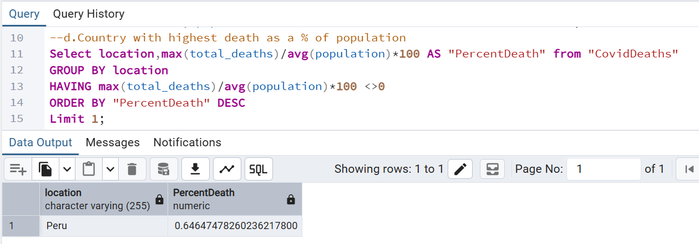
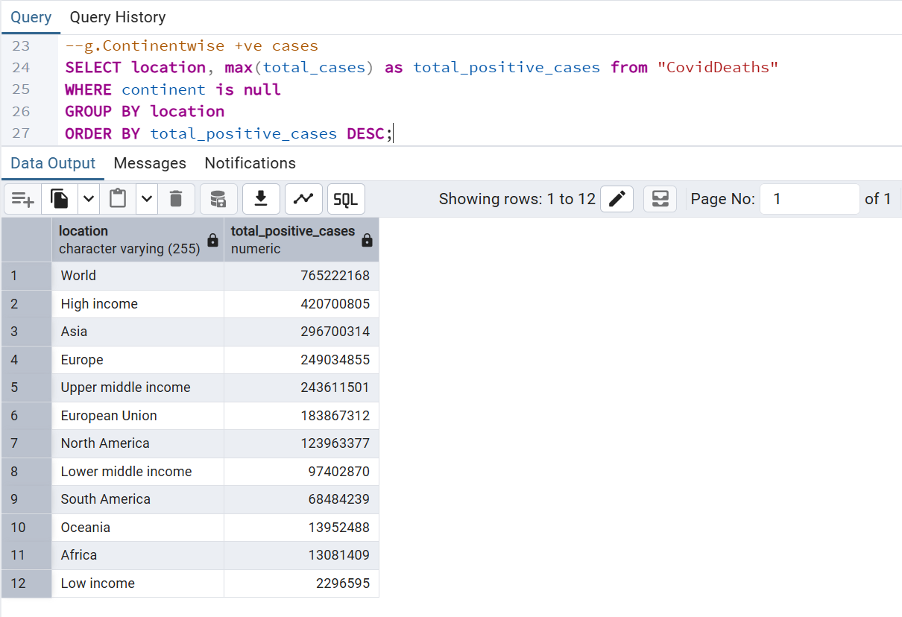
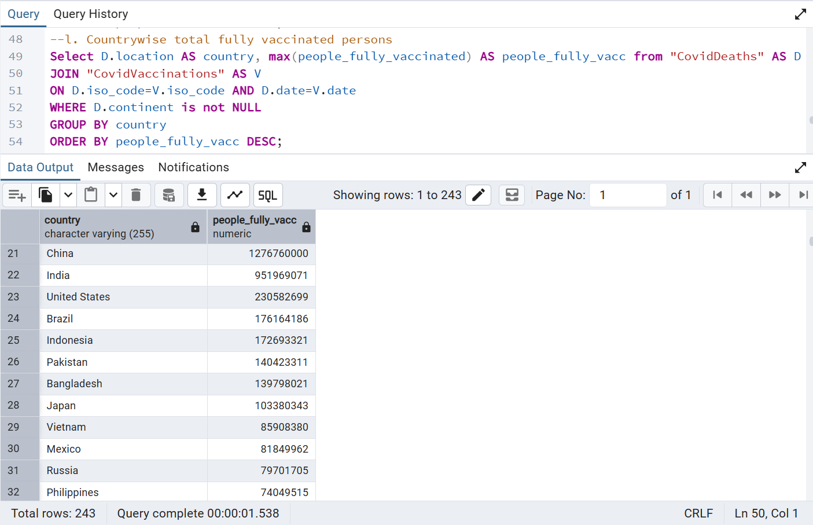
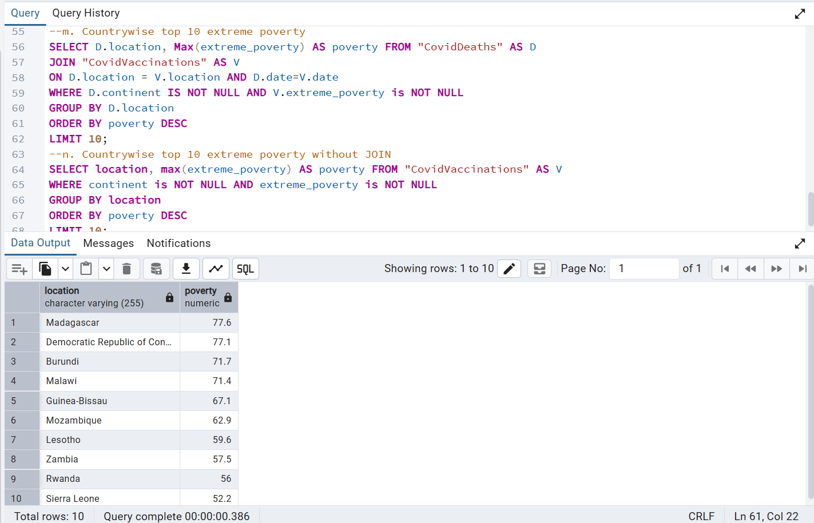

# COVID-19 Data Analysis with SQL

## About the Project

This is a SQL portfolio project where I analysed COVID-19 data using PostgreSQL.

The goal was to practice SQL on a real-world dataset and answer questions related to cases, deaths, vaccinations and socioeconomic indicators across different countries and continents.

## Dataset

Source: Our World in Data (OWID)

https://ourworldindata.org/

Tables used:

- CovidDeaths
- CovidVaccinations

## Tools Used

- PostgreSQL
- pgAdmin
- SQL

## What I Analyzed

- COVID-19 cases and deaths in India
- Death percentage compared to population
- Countries with the highest death rates
- Countries with the highest infection rates
- Continent-level case and death analysis
- Vaccination statistics by country
- Population aged 65+
- Extreme poverty by country

## SQL Skills Practiced

- SELECT
- WHERE
- GROUP BY
- ORDER BY
- HAVING
- JOIN
- Aggregate Functions (SUM, AVG, MAX, MIN)
- Data Exploration

## Files

- COVID-19-Data-Analysis-SQL.sql
- CovidDeaths.csv
- CovidVaccinations.csv

## What I Learned

During this project I practiced importing data into PostgreSQL, creating tables, writing SQL queries, working with joins and aggregate functions, and exploring real-world data to answer business questions.

## Sample Outputs

### Country with Highest Death Percentage

### Continent Cases Analysis

### Fully Vaccinated Population by Country

### Top 10 Extreme Poverty Countries

## Author

**Vasileios Tatsidis**

Finance professional with experience in financial reporting and analysis, currently expanding expertise in SQL, Power BI, data analytics, and business intelligence.

GitHub Portfolio:
https://github.com/TatsidisVasilis

